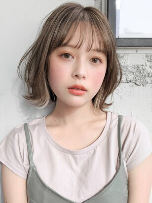

### Summary
- 任意の物体を特別なテキスト表現として画像生成AI内に取り込み、多様な形式で出力させる
- CLIP/BLIPなどと組み合わせることで、ヘアスタイルなどに必要なプロンプトジェネレータと画像生成を両立させることが可能

### Examples
- インタラクティブなヘアアレンジの相談窓口
- ネイル・服装などのコンサル

### Results

### Related Links
- [DreamBooth](https://dreambooth.github.io/)
- [InstructBlip](https://ja.stability.ai/blog/japanese-instructblip-alpha)

### Related Notebooks

### Tags
- stable diffusion
- dreambooth
- Image2Text
- Object Detection