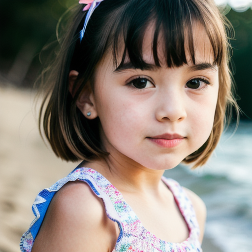

### Summary
- 画像内部の物体において部分的な編集を可能にしている
- segmentation modelの精度に限界がある部分とテキストベースでしか制御できない部分がある
- Image2CaptionモデルとLLMを利用することでリッチなテキスト表現で制御することも可能

### Examples
- 髪色や髪型の変化
- 服装の変化とかコントロール(特にweddingドレスとかいい感じ)
- 掲載物の部分的編集
- ブーケなどのワンポイントアイテムの追加

### Results

### Related Links
- [Segment Anything](https://segment-anything.com/)
- [Dreambooth](https://dreambooth.github.io/)
- [ControlNet](https://github.com/lllyasviel/ControlNet-v1-1-nightly)
- [InstructBlip](https://ja.stability.ai/blog/japanese-instructblip-alpha)

### Related Notebooks

### Tags
- stable diffusion
- segmentation
- Image2Text
- Object Detection
- Dreambooth
