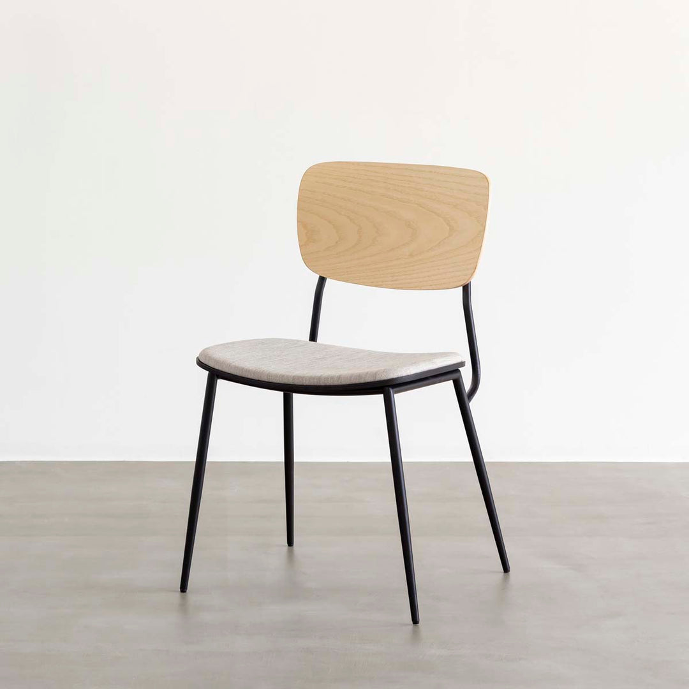

### Summary
- 対象の物体や画像において部分的な編集を可能にした
- 特にテクスチャなどの変更に役立つ
- テキストでは表現できないようなテクスチャにおいてもカバーが可能

### Examples
- 髪色や髪型の変化
- 部屋の内装の色合いなどを変化
- 掲載画像のスタイルを部分的に変化させる

### Results

### Related Links
- [Segment Anything](https://segment-anything.com/)
- [Matting Anything](https://github.com/SHI-Labs/Matting-Anything)
- [ControlNet](https://github.com/lllyasviel/ControlNet-v1-1-nightly)
- [MaskBlend](https://note.nkmk.me/python-pillow-composite/)
- [InstructBlip](https://ja.stability.ai/blog/japanese-instructblip-alpha)

### Related Notebooks

### Tags
- stable diffusion
- segmentation
- LLM
- Image2Text
- ControlNet
